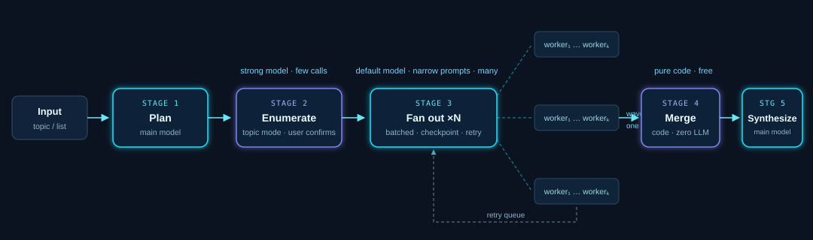

# WideHive

*A hive of agents for wide questions. — 把一个问题，交给一整个蜂巢。*

Wide Research orchestration for AutoClaw & OpenClaw agents — fan out 100+ context-isolated sub-agents
over a large research target list, merge the results programmatically with zero
LLM calls, and synthesize a scenario-shaped report.

<p align="center">
  
</p>

## Why

LLMs start "slacking off" once their output fills 20–50% of the context window:
they skip sentences, compress, paraphrase. Any research task with dozens or
hundreds of objects hits this wall — the model diligently handles the first ten
items and silently mangles the rest.

WideHive sidesteps the wall with divide-and-conquer:

- **Context isolation** — every object gets its own sub-agent, so every output
  stays short and faithful.
- **Programmatic merge** — a script (not an LLM) aggregates and validates, so
  the aggregation step adds zero hallucination.
- **Honest gaps** — a worker that cannot verify a value writes `null` instead
  of guessing; the merge script flags it and it goes back to the retry queue.

This strategy follows [Manus Wide Research](https://manus.im/blog/introducing-WideHive)
and is validated by the open-source
[codex_wide_research](https://github.com/grapeot/codex_wide_research)
experiment: 53/53 blog posts summarized with zero hallucinations, where
single-context baselines (Deep Research, manual agent) covered only 12–20
before stalling.

## Quick start

**In AutoClaw (recommended):** WideHive lives in AutoClaw's skill market
(ClawHub). Install it from the market — or simply ask your AutoClaw assistant
to install `WideHive` — then trigger it in chat: *「用 WideHive 调研 …」*.

**On any other OpenClaw agent:**

```bash
# From ClawHub:
openclaw skills install widehive

# Or manually: copy the skill folder into your workspace skills/ directory
git clone https://github.com/<owner>/WideHive.git
cp -r WideHive/skill <your-workspace>/skills/widehive
```

**Use** — just say it in conversation:

```
Use WideHive to compare the latest annual reports of these 30 companies:
<list>            # financial scenario → CSV/Excel table first

用 WideHive 调研近三年国内 AR 眼镜厂商的主力产品   # topic mode →
                                                      # enumerate first, you confirm, then fan out
```

**What happens**: the agent plans → (enumerates and asks you to confirm the
target list if you only gave a topic) → dispatches batched sub-agents, one per
object → merges and validates with code → writes the final report and hands you
the raw per-object results for verification.

## How it works

| Stage | Actor | What happens |
|---|---|---|
| 1 Plan | main model | classify input (list vs topic), pick scenario, write `plan.json` |
| 2 Enumerate | main model + web search | topic mode only: build candidate list, user confirms |
| 3 Fan out | sub-agents (default model) | batches of ~10, one narrow prompt per object, result file per object |
| 4 Merge | **pure code** | aggregate + validate required fields / URLs / lengths → `PASS` / `NEEDS_RETRY` |
| 5 Synthesize | main model | read merged data, spot-check 2–3 objects, deliver scenario-shaped report |

### Iron rules

1. One object per sub-agent — never batch objects.
2. Narrow worker prompts — object, template, output path; nothing else.
3. Short worker outputs — template fields only; overlong = retry.
4. Merge with code — zero LLM calls in the merge stage.
5. One file per object — `result/<slug>.json` is the checkpoint; resume only
   what is missing.

## Field templates

Default per scenario, freely overridable:

| Scenario | Default fields | Default deliverable |
|---|---|---|
| `financial` | name, ticker, revenue, net_profit, gross_margin, yoy, key_segments, risks, source_urls | CSV/Excel table + compact report |
| `academic` | title, authors, year, venue, research_question, method, findings, limitations, url | single-page HTML review, traceable |
| `tech` | name, owner, positioning, latest_version, stars, license, activity, pros, cons, url | comparison table + analysis |

## The merge script

```bash
python skill/scripts/merge_results.py --run-dir WideHive/<run_id>
```

Stdout is a JSON verdict report:

```json
{
  "total_targets": 3, "with_results": 3, "ok": 3,
  "missing_files": [], "defects": [],
  "verdict": "PASS"
}
```

`NEEDS_RETRY` lists exactly which object is missing which field — feed that
back to the retry queue. Pure standard library, Python 3.8+, no dependencies.

## Watch mode (scheduled monitoring)

Set `"mode": "watch"` and a `watch` block in `plan.json`, schedule the run with
your platform's cron, and WideHive turns a one-shot survey into a monitored
feed: each trigger diffs the target list against the previous run (pure code,
zero cost), re-runs **only the changed objects**, and emits a change report
with per-field diffs and sources. Idle runs cost nothing.

First scenario pack: [`scenarios/financial-filings.md`](scenarios/financial-filings.md)
— prospectus/annual-report extraction with currency discipline and
IFRS-vs-adjusted separation.

## Corpus & dashboard

Finished runs become a **queryable corpus** (`build_corpus.py` → `corpus.jsonl`):
follow-up questions get answered from what you already researched, citing run
and fetch date — no re-fanning. And any `merged.json` can be turned into a
**self-contained interactive dashboard** (`build_dashboard.py`) with search,
sort, drill-down and charts.

## A real run (archived in `examples/smoke-test-3repos/`)

Three GitHub repositories, one worker each, on a stock AutoClaw / OpenClaw agent:

| Object | Version | Stars | License | Sources |
|---|---|---|---|---|
| LangGraph | v0.4.4 | 41,583 | MIT | 3 |
| CrewAI | v1.15.17 | 58,479* | MIT | 2 |
| AutoGen | v0.12.2 | 58,294 | MIT (code) / CC-BY-4.0 (docs) | 2 |

\* CrewAI's worker honestly reported `null` (search snapshots were stale)
instead of guessing; the merge script flagged it and the orchestrator patched
it from the GitHub API — the failure-handling loop working as designed.

## Requirements

- Required: an AutoClaw / OpenClaw agent (or equivalent harness) with sub-agent spawning
  (`sessions_spawn`) and file read/write tools for workers.
- Optional: enhanced web-open tools (e.g. AutoGLM open-link) improve anti-crawl
  fetching; the built-in web fetch works as fallback.
- Python 3.8+ for the merge script (standard library only).

## FAQ

**How is this different from Deep Research?**
Deep research goes deep on one thread in a single context; wide research goes
wide across many objects with isolated contexts. They compose: enumerate with
one, fan out with the other.

**What does a 100-object run cost?**
Workers use the default model with narrow prompts and short outputs — roughly
1–3M tokens for the whole fan-out on typical setups, dominated by the worker
stage. The merge step costs nothing.

**Why is the merge step code instead of an LLM?**
Because aggregation is exactly where hallucinated summaries get stitched
together. A script validates fields mechanically; only the final narrative is
written by a model, from validated data.

**Does it work outside AutoClaw?**
Yes — AutoClaw is built on the OpenClaw agent runtime, and WideHive targets
that runtime: any OpenClaw-based distribution works with
`openclaw skills install widehive`. The orchestration discipline itself is
harness-agnostic.

## Attribution

- Strategy inspired by [Manus Wide Research](https://manus.im/blog/introducing-WideHive).
- Divide-merge pattern and validation methodology informed by
  [grapeot/codex_wide_research](https://github.com/grapeot/codex_wide_research).

## License

[MIT](LICENSE)
